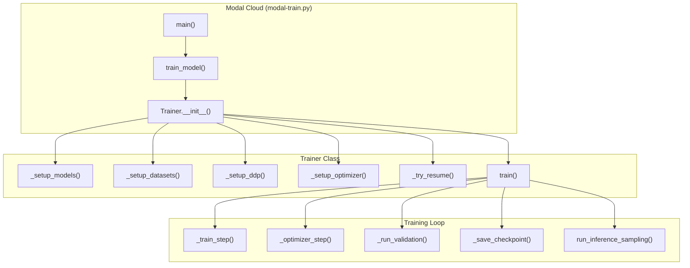
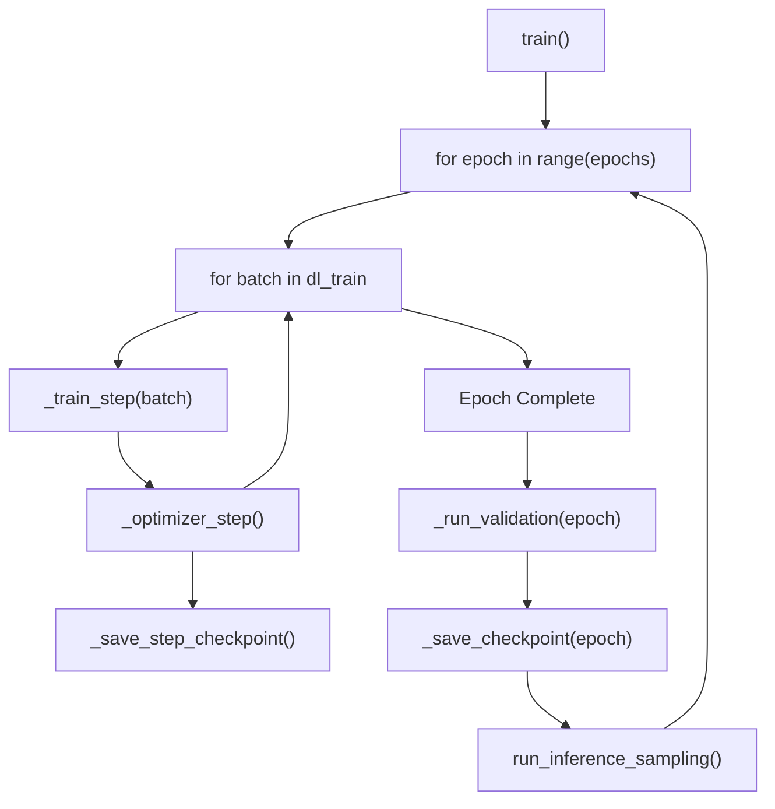

# LiDAR-Vision-VQA Training Pipeline

> Function-level breakdown of the training pipeline flow

---

## Overview: What This Model Does

### The Task: Autonomous Driving Scene Understanding

This system trains a **Vision-Language Model (VLM)** for autonomous driving applications. The model takes **6-camera surround-view images** from a vehicle and answers natural language questions about the driving scene. 

**Example Input/Output:**
- **Input**: 6 camera images (front, front-left, front-right, back, back-left, back-right) + Question: *"What objects are ahead of the vehicle?"*
- **Output**: *"A silver sedan is approximately 15 meters ahead in the left lane. A pedestrian is crossing from the right at 20 meters."*

### The Architecture: How It Achieves This

The model combines three key components into a unified vision-language system:

```
┌─────────────────────────────────────────────────────────────────────────────┐
│                           INPUT: 6 Camera Views                             │
│    [CAM_FRONT] [CAM_FRONT_RIGHT] [CAM_FRONT_LEFT]                          │
│    [CAM_BACK]  [CAM_BACK_RIGHT]  [CAM_BACK_LEFT]                           │
└─────────────────────────────────────────────────────────────────────────────┘
                                    │
                                    ▼
┌─────────────────────────────────────────────────────────────────────────────┐
│                    DEEPENCODER (Vision Encoder)                             │
│  ┌──────────────────┐    ┌──────────────────┐    ┌─────────────────────┐   │
│  │   SAM ViT-B      │    │   CLIP ViT-L/14  │    │   MlpProjector     │   │
│  │   (FROZEN)       │───▶│   (LoRA tuned)   │───▶│   → d_model dim    │   │
│  │   Spatial feats  │    │   Semantic feats │    │   256 tokens/view  │   │
│  └──────────────────┘    └──────────────────┘    └─────────────────────┘   │
│                                                                             │
│  Output: 6 views × 256 tokens × d_model dimension = 1,536 vision tokens    │
└─────────────────────────────────────────────────────────────────────────────┘
                                    │
                                    ▼
┌─────────────────────────────────────────────────────────────────────────────┐
│                       VISION ADAPTER (no projection!)                       │
│  • Adds learned per-view positional embeddings (front vs back, left vs right)│
│  • Applies LayerNorm + Dropout for regularization                           │
│  • Wraps each view with delimiter tokens: <cam_front_start>...<cam_front_end>│
│  • Input/Output: same d_model dimension (NO additional projection)          │
└─────────────────────────────────────────────────────────────────────────────┘
                                    │
                                    ▼
┌─────────────────────────────────────────────────────────────────────────────┐
│                        QWEN2 LLM (QLoRA 4-bit)                              │
│  Input sequence: [vision_tokens] + [text_prompt] + [answer] (training)     │
│                  [vision_tokens] + [text_prompt] (inference → generate)    │
│                                                                             │
│  • 4-bit quantized base weights (memory efficient)                         │
│  • LoRA adapters on attention layers (trainable)                           │
│  • Gradient checkpointing (memory vs compute tradeoff)                     │
└─────────────────────────────────────────────────────────────────────────────┘
                                    │
                                    ▼
┌─────────────────────────────────────────────────────────────────────────────┐
│                            OUTPUT                                           │
│  Natural language response describing the driving scene                    │
└─────────────────────────────────────────────────────────────────────────────┘
```

### Functional Requirements

| Requirement | Implementation |
|-------------|----------------|
| **Multi-view fusion** | 6 cameras encoded independently, then concatenated with view-specific position embeddings |
| **Spatial awareness** | SAM provides fine-grained spatial features (16×16 grid = 256 tokens per view) |
| **Semantic understanding** | CLIP provides high-level semantic understanding of scene content |
| **Memory efficiency** | QLoRA (4-bit quantization + LoRA adapters) reduces GPU memory by ~4x |
| **Long training resilience** | 24-hour timeout with auto-resume from checkpoints (up to 10 days total) |
| **Reproducibility** | Full RNG state saved/restored, deterministic samplers, seeded data splits |

### Training Objective

The model is trained with **causal language modeling loss**:
- Only the **answer tokens** are supervised (loss computed)
- Vision tokens and question tokens have labels set to -100 (ignored in loss)
- This teaches the model to generate appropriate responses given visual context

### Expected Outputs

After training, the model can:
1. **Describe scenes**: "There are 3 vehicles ahead, a cyclist on the left, and clear road behind"
2. **Localize objects**: "The pedestrian is 12 meters ahead, slightly to the right"
3. **Assess situations**: "The intersection ahead has a red traffic light, recommend stopping"
4. **Answer queries**: Respond to specific questions about the driving environment

---




---

## Entry Point: `modal-train.py`

### `main()` → Local Entrypoint
```
main()
├── Verifies project root exists (./src)
└── Calls train_model.remote() → Deploys to Modal cloud
```

### `train_model()` → Modal Function (24h timeout, 10 retries)
```
train_model()
├── Setup environment paths (/root/src)
├── Configure model cache directories (HF_HOME, TORCH_HOME)
├── _ensure_flash_attn_cached() → Install/cache flash-attn wheel
├── get_modal_training_config() → Load config from configs module
├── Auto-discovery of latest run directory
├── Resume decision logic (find training_state_latest.pt)
├── Trainer(config) → Initialize trainer
└── trainer.train() → Start training loop
```

---

## Core: `Trainer` Class (`trainer.py`)

### `__init__(config)` → Initialization
```
Trainer.__init__(config)
├── validate_config() → Check for conflicting settings
├── init_dist_if_needed() → Setup distributed training
├── set_seed() → Reproducibility
├── _setup_models() ──────────────────────────────────────┐
├── _setup_datasets() ────────────────────────────────────┤
├── _setup_ddp() ─────────────────────────────────────────┤
├── _setup_optimizer() ───────────────────────────────────┤
├── Initialize GradScaler (mixed precision) ──────────────┤
└── _try_resume() (if resume=True) ───────────────────────┘
```

### `_setup_models()` → Model Initialization
```
_setup_models()
└── setup_models(config, device, is_main)  [model_setup.py]
    ├── AutoTokenizer.from_pretrained() → Load Qwen tokenizer
    ├── tok.add_special_tokens() → Add per-view delimiters
    ├── AutoModelForCausalLM.from_pretrained() → Load Qwen2 LLM
    │   └── quantization_config → QLoRA 4-bit if enabled
    ├── base.resize_token_embeddings() → Expand for special tokens
    ├── make_lora() → Apply LoRA/QLoRA adapters to LLM
    ├── NuScenes() → Load nuScenes dataset
    ├── DeepEncoderRuntime() ──────────────────────────────────┐
    │   ├── build_sam_vit_b() → SAM encoder (frozen)           │
    │   ├── build_clip_l() → CLIP ViT-L/14                     │
    │   ├── load_openclip_vitl14_into_vitmodel() → Load weights│
    │   ├── get_peft_model() → LoRA for CLIP (if enabled)      │
    │   └── MlpProjector() → Project to d_model dimension      │
    └── VisionAdapter(d_model) → View embeddings + projection  ┘
```

### `_setup_datasets()` → Data Pipeline
```
_setup_datasets()
├── VisionNuDataset(json_paths, ...) → Load QA pairs
│   └── validate_json_schema, validate_image_paths
├── torch.utils.data.random_split() → Train/Val split
├── DistributedSampler or SingleProcessDetSampler
├── make_collate(tok, ...) → Batch collation function
└── DataLoader(ds_train/ds_val) → With prefetch, persistent workers
```

### `_setup_optimizer()` → Optimizer & Scheduler
```
_setup_optimizer()
└── setup_optimizer_and_scheduler()  [model_setup.py]
    ├── Collect params: lora_params, vision_params, va_params
    ├── torch.optim.AdamW(optim_groups, fused=True)
    └── get_cosine_schedule_with_warmup()
```

### `_try_resume()` → Checkpoint Resume
```
_try_resume()
├── try_load_state(out_dir) → Load training_state_latest.pt
├── base.load_state_dict() → Restore LLM weights
├── Load vision_adapter, projector, sam_compression_head
├── _validate_lora_config() → Check LoRA config consistency
├── set_peft_model_state_dict() → Restore LoRA adapters
├── optim.load_state_dict(), sched.load_state_dict()
├── scaler.load_state_dict() → Restore GradScaler state
└── Restore RNG states (random, np.random, torch)
```

---

## Training Loop: `train()`



### `train()` → Main Loop
```
train()
├── base.train(), vision_adapter.train(), runtime.train()
├── Check if training already complete
├── for epoch in range(start_epoch, epochs+1):
│   ├── _set_epoch(epoch) → Set sampler epoch
│   ├── for batch in dl_train:
│   │   ├── _train_step(batch) → Forward + backward
│   │   ├── if it % grad_accum == 0:
│   │   │   ├── _optimizer_step() → Update weights
│   │   │   └── _save_step_checkpoint() if save_every_steps
│   │   └── Check if global_step >= total_steps
│   ├── epoch_losses.append(avg_epoch_loss)
│   ├── if epoch % validate_every == 0:
│   │   └── _run_validation(epoch)
│   ├── _save_checkpoint(epoch)
│   └── run_inference_sampling() if inference_every
└── plot_loss_curve()
```

### `_train_step(batch)` → Single Training Step
```
_train_step(batch)
├── batch["prompt_ids"].to(device)
├── batch["answer_ids"].to(device)
├── batch["sample_tokens"]
│
├── ── VISION ENCODING ──
│   ├── if "images" in batch (pre-loaded):
│   │   └── runtime.encode_preloaded_views_batch(images)
│   └── else (fallback):
│       └── batch_multiview_tokens_from_sample_tokens()
│   └── vision_adapter.forward_batch(view_tokens)
│
├── ── EMBEDDING ASSEMBLY ──
│   ├── E = base.get_input_embeddings()
│   ├── tok_emb = E(prompt_ids)
│   ├── ans_emb = E(answer_ids)
│   └── build_training_sequence() → [vision][text][answer]
│       └── Returns: inp, sequence_metadata
│
├── ── FORWARD PASS ──
│   ├── labels = torch.full(..., -100) → Mask non-answer
│   ├── labels[:, ans_start:ans_end] = a_ids
│   └── out = base(inputs_embeds=inp, labels=labels)
│
├── ── BACKWARD PASS ──
│   ├── loss = out.loss / grad_accum
│   └── scaler.scale(loss).backward()
│
└── return loss.item() * grad_accum
```

### `_optimizer_step()` → Weight Update
```
_optimizer_step()
├── scaler.unscale_(optim)
├── clip_grad_norm_(base.parameters())
├── clip_grad_norm_(vision_adapter.parameters())
├── clip_grad_norm_(runtime.projector.parameters())
├── clip_grad_norm_(runtime.clip_vit.parameters())
├── clip_grad_norm_(runtime.sam.parameters())  # compression heads
├── scaler.step(optim)
├── scaler.update()
├── sched.step()
└── optim.zero_grad(set_to_none=True)
```

---

## Validation: `validation.py`

### `_run_validation(epoch)` → Trainer Method
```
_run_validation(epoch)
├── run_validation(dl_val, ...) ──────────────────────────────┐
│   ├── base.eval(), vision_adapter.eval(), runtime.eval()    │
│   ├── for batch in dl_val:                                  │
│   │   ├── batch_multiview_tokens_from_sample_tokens()       │
│   │   ├── vision_adapter.forward_batch()                    │
│   │   ├── build_training_sequence()                         │
│   │   └── out = base(inputs_embeds, labels)                 │
│   └── return total_loss / count                             │
├── val_losses.append(val_loss)                                │
└── if val_loss < best_val_loss:                              │
    └── _save_best_checkpoint()                                │
```

### `run_inference_sampling()` → Generate Predictions
```
run_inference_sampling(base, vision_adapter, runtime, ...)
├── base.eval(), gradient_checkpointing_disable()
├── Load validation samples from val_dataset
├── validate_image_paths() → Check camera images exist
├── ── BATCHED ENCODING PHASE ──
│   └── for batch in samples:
│       ├── batch_multiview_tokens_from_sample_tokens()
│       └── vision_adapter.forward_batch()
├── ── GENERATION PHASE ──
│   └── for sample in encoded_samples:
│       ├── build_inference_sequence() → [vision][prompt]
│       ├── base.generate(inputs_embeds, max_new_tokens=...)
│       └── tok.decode(outputs)
├── calculate_metrics_by_type(results) → BLEU, CIDEr, etc.
└── Save inference_sampling_epoch{N}.json
```

---

## DeepEncoder: `deepencoder_infer.py`

### `DeepEncoderRuntime` → Vision Encoder
```
DeepEncoderRuntime.__init__()
├── download_sam_if_needed() → Fetch SAM weights
├── build_sam_vit_b() → SAM ViT-B encoder (FROZEN)
├── build_clip_l() → CLIP ViT-L/14 (LoRA optional)
├── load_openclip_vitl14_into_vitmodel() → Load CLIP weights
├── get_peft_model() → Apply LoRA if enabled
└── MlpProjector() → Project [CLIP+SAM] → output_dim
```

### Key Methods
```
DeepEncoderRuntime
├── encode_image(image_path) → [256, output_dim] tokens
│   ├── resize_and_pad_to_square(im, 1024)
│   ├── _pil_to_tensor_sam_norm() → SAM normalization
│   ├── _sam_features(x) → [1, 256, 64, 64] frozen features
│   ├── clip_vit(sam_features) → [1, 257, 1024] CLIP tokens
│   ├── projector(sam + clip) → [256, output_dim]
│   └── return tokens
│
├── encode_preloaded_views(tensors) → [6, 256, output_dim]
│   └── Process pre-loaded tensors (no I/O)
│
├── encode_preloaded_views_batch(batch) → [[6 tensors] * B]
│   └── Batched version for training efficiency
│
└── encode_views(nusc, sample_token) → Dict with tokens
    └── resolve_cam_image_paths() + encode per view
```

---

## Checkpoint Structure

```
checkpoints/
└── run_YYYYMMDD_HHMMSS/
    ├── training_state_latest.pt    # Full state (optim, sched, etc.)
    ├── qwen2_lora_adapter_latest/  # LLM LoRA weights
    ├── clip_lora_adapter_latest/   # CLIP LoRA weights
    ├── vision_adapter_latest.pt    # VisionAdapter weights
    ├── projector_latest.pt         # MlpProjector weights
    ├── sam_compression_head_latest.pt  # SAM net_2/net_3
    ├── config.json                 # Training config
    ├── train.log                   # Training log
    ├── step_loss_curve.png         # Step-level loss plot
    └── inference_sampling_epoch{N}.json
```

---

## Call Graph Summary

```
modal run modal-train.py
└── main()
    └── train_model.remote()
        └── Trainer(config)
            ├── setup_models() ──→ Qwen2 + DeepEncoder + VisionAdapter
            ├── setup_datasets() ──→ VisionNuDataset + DataLoader
            ├── setup_optimizer() ──→ AdamW + Cosine schedule
            └── train()
                ├── _train_step() ──→ Forward + Backward
                │   ├── encode_preloaded_views_batch()
                │   ├── vision_adapter.forward_batch()
                │   ├── build_training_sequence()
                │   └── base(inputs_embeds, labels)
                ├── _optimizer_step() ──→ Gradient clip + Update
                ├── _run_validation() ──→ Val loss
                ├── run_inference_sampling() ──→ Generate + Metrics
                └── _save_checkpoint() ──→ Persist state
```
