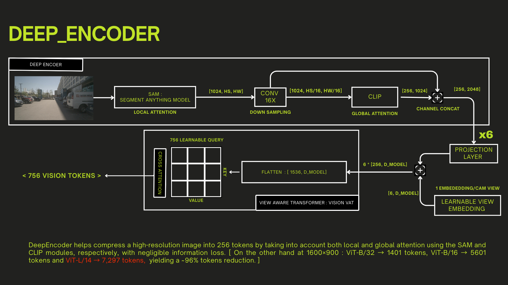

# LiDAR-Vision-VQA

LiDAR-Vision-VQA fuses 3D LiDAR geometry with multi-camera context to answer free-form questions about complex urban driving scenes. The system combines a voxel-based LiDAR encoder, a vision-language backbone, and task-specific adapters to reason jointly about objects, layouts, and semantics for downstream VQA, captioning, and grounding tasks.

## Architecture Snapshots

