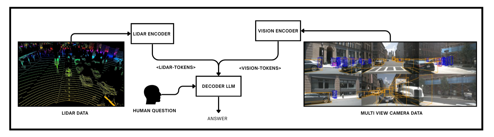
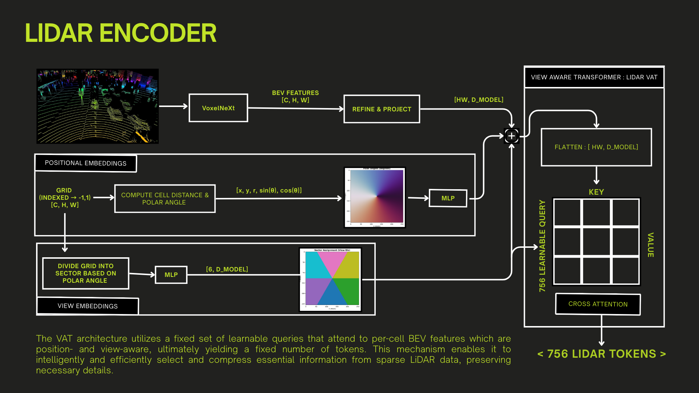

# LiDAR-Vision-VQA: Multimodal Visual Question Answering for Autonomous Driving


LiDAR-Vision-VQA fuses 3D LiDAR geometry with multi-camera context to answer free-form questions about complex urban driving scenes. The system combines a voxel-based LiDAR encoder, a vision-language backbone, and task-specific adapters to reason jointly about objects, layouts, and semantics for downstream VQA, captioning, and grounding tasks.

## 🎯 Overview

**LiDAR-Vision-VQA** is an advanced multimodal Visual Question Answering system specifically designed for autonomous driving scenarios. It seamlessly integrates:

- **🔷 LiDAR BEV Features**: 3D spatial understanding through Bird's Eye View representations
- **📷 Multi-Camera Vision**: 6-camera surround-view perception using CLIP and SAM encoders
- **🤖 Large Language Model**: Natural language understanding and generation
### Why LiDAR-Vision-VQA?

Traditional VQA systems often rely solely on camera images, missing crucial 3D spatial information. By fusing LiDAR BEV features with multi-view camera data, our system achieves:
- **Superior 3D spatial reasoning** through BEV representations
- **Robust scene understanding** across different lighting and weather conditions
- **Accurate object localization** combining vision and depth information

## 🏛️ Architecture

The system consists of three main components:

### 1. **LiDAR Encoder** (`src/lidar-encoder/`)
- Built on PCDet framework for 3D object detection
- Extracts BEV feature maps from LiDAR point clouds
- Outputs: `[B, C, H, W]` BEV tensors (e.g., 256×256×256)

### 2. **Vision Encoder** (`src/deepencoder/`)
- **CLIP ViT-L/14**: Semantic understanding (1024-dim per token)
- **SAM ViT-B**: Spatial and structural features (1024-dim per token)
- **Projector**: Fuses features to 2048-dim per-token representation
- Processes 6 camera views: Front, Front-Left, Front-Right, Back, Back-Left, Back-Right
- Outputs: `[6 views × 256 tokens, 2048-dim]` = 1536 tokens per sample

### 3. **Encoder-Decoder** (`src/encoder-decoder/`)
The core multimodal fusion and language generation module:

#### **VATVision** (Vision VAT)
- **Input**: 1536 vision tokens `[1536, 2048]` from 6 camera views
- **Processing**:
  - Spatial positional encodings (continuous grid coordinates)
  - View embeddings (discrete camera identifiers)
  - Learned query tokens with cross-attention
- **Output**: Compact vision representation `[n_queries, d_model]`

#### **VATLiDAR** (LiDAR VAT)
- **Input**: BEV feature maps `[B, C, H, W]`
- **Processing**:
  - Geometric positional encodings (x, y, r, sin θ, cos θ)
  - 6-sector view embeddings (spatial partitioning)
  - View-aligned query tokens with cross-attention
- **Output**: Compact BEV representation `[n_queries, d_model]`

#### **Sequence Construction**
```
[<vision_start>] [vision_queries] [<vision_end>]
[<lidar_start>]  [lidar_queries]  [<lidar_end>]
[text_prompt_tokens]
[answer_tokens]  # Training only
```

#### **Language Model Integration**
- Base LLM: Qwen2.5 (0.5B/1.5B/3B variants supported, 3B recommended for Modal)
- LoRA adaptation for efficient fine-tuning
- Flash Attention 2 for faster training
- Quantization support (4-bit, 8-bit)

#### Architecture Snapshots






## 🔧 Installation

### Prerequisites
- **Python**: 3.11
- **CUDA**: 12.0+ (12.6 recommended)
- **GPU**: NVIDIA GPU with 24GB+ VRAM (e.g., RTX 4090, A100, H100, L4)
- **Storage**: ~100GB for datasets and models

### Step 1: Create Conda Environment
```bash
conda create --name lidar-vqa python=3.11 -y
conda activate lidar-vqa
```

### Step 2: Install PyTorch
```bash
# For CUDA 12.6
pip3 install torch torchvision --index-url https://download.pytorch.org/whl/cu126

# For CUDA 12.0
pip3 install torch torchvision --index-url https://download.pytorch.org/whl/cu120
```

### Step 3: Install LiDAR Encoder (PCDet)
```bash
cd src/lidar-encoder/

# Install dependencies
pip install llvmlite numba tensorboardX easydict pyyaml scikit-image tqdm SharedArray opencv-python pyquaternion

# Install spconv (adjust for your CUDA version)
pip install spconv-cu120  # or spconv-cu126

# Install PCDet in editable mode
pip install -e . --no-build-isolation

# Verify installation
python tools/verify_dependency.py

cd ../..
```

### Step 4: Install Core Dependencies
```bash
pip install -r requirements.txt
```

### Step 5: Download NLTK Data (for evaluation)
```bash
python -c "import nltk; nltk.download('punkt'); nltk.download('wordnet')"
```

### Step 6: Install Flash Attention (Optional but Recommended)
```bash
# Must be installed after all other dependencies
pip install flash-attn --no-build-isolation
```

### Verify Installation
```bash
python -c "import torch; print(f'PyTorch: {torch.__version__}'); print(f'CUDA: {torch.cuda.is_available()}')"
python -c "from pcdet.version import __version__; print(f'PCDet: {__version__}')"
```

---

## 📁 Project Structure

```
LiDAR-Vision-VQA/
├── readme.md                           # This file
├── requirements.txt                    # Python dependencies
├── .gitignore                          # Git ignore rules
│
├── src/                                # Source code
│   ├── configs/                        # Configuration files
│   │   ├── default_config.py          # Default training config
│   │   ├── modal_config.py            # Modal cloud training config
│   │   └── training_config.py         # Additional training configs
│   │
│   ├── lidar-encoder/                  # LiDAR BEV feature extraction
│   │   ├── pcdet/                     # PCDet framework (3D detection)
│   │   ├── tools/                     # Utility scripts
│   │   ├── readme.md                  # LiDAR encoder documentation
│   │   └── setup.py                   # Installation script
│   │
│   ├── deepencoder/                    # Vision feature extraction
│   │   ├── clip_sdpa.py               # CLIP ViT-L/14 encoder
│   │   ├── sam_vary_sdpa.py           # SAM ViT-B encoder
│   │   ├── deepencoder_infer.py       # Inference wrapper
│   │   └── build_linear.py            # Projection layers
│   │
│   ├── encoder-decoder/                # Main training & inference
│   │   ├── train.py                   # Local training script
│   │   ├── infer.py                   # Local inference script
│   │   ├── training/                  # Training modules
│   │   │   ├── core/                  # Core training logic
│   │   │   │   └── trainer.py         # Main Trainer class
│   │   │   ├── models/                # Model architectures
│   │   │   │   ├── vat_vision.py      # Vision VAT
│   │   │   │   ├── vat_lidar.py       # LiDAR VAT
│   │   │   │   ├── vat_blocks.py      # Shared VAT components
│   │   │   │   ├── vision_adapter.py  # Vision preprocessing
│   │   │   │   └── lora_utils.py      # LoRA utilities
│   │   │   ├── data/                  # Dataset and dataloading
│   │   │   │   ├── dataset.py         # Main dataset class
│   │   │   │   ├── collate.py         # Batch collation
│   │   │   │   ├── sampler.py         # Data sampling
│   │   │   │   └── utils.py           # Data utilities
│   │   │   └── utils/                 # Training utilities
│   │   │       ├── metrics.py         # Evaluation metrics
│   │   │       ├── checkpoints.py     # Checkpoint management
│   │   │       ├── logging.py         # Logging utilities
│   │   │       └── ...
│   │   ├── inference/                 # Inference modules
│   │   │   ├── engine.py              # Inference engine
│   │   │   ├── loader.py              # Model loader
│   │   │   └── utils.py               # Inference utilities
│   │   └── training-test/             # Unit tests
│   │       ├── models/                # Model tests
│   │       ├── data/                  # Data tests
│   │       └── utils/                 # Utility tests
│   │
│   ├── modal-trainer/                  # Modal cloud training
│   │   ├── modal-train.py             # Modal training entry point
│   │   ├── modal-infer.py             # Modal inference entry point
│   │   ├── modal-test.py              # Modal testing
│   │   └── requirements-modal.txt     # Modal-specific deps
│   │
│   └── get-data/                       # Data preprocessing
│       ├── precompute_bev_features.py # BEV feature extraction
│       ├── create_nuScenes_subset.py  # Dataset subsetting
│       └── get_nuscenes_with_extract.py # Data download helper
│
├── modal_inference_*/                  # Inference outputs (gitignored)
│   └── YYYYMMDD_HHMMSS/
│       ├── artifacts/                 # Per-sample JSON predictions
│       ├── viz/                       # Visualization images
│       ├── inference_sampling_*.json  # All predictions
│       ├── metrics_summary_*.json     # Aggregated metrics
│       └── create_visualizations.py   # Visualization script
│
└── checkpoints/                        # Training checkpoints (gitignored)
    └── run_YYYYMMDD_HHMMSS/
        ├── checkpoint_step_*/         # Per-step checkpoints
        ├── best_checkpoint/           # Best performing checkpoint
        ├── training.log               # Training logs
        └── config.json                # Training configuration
```

---

## 📊 Results

### Performance Metrics

#### Caption Generation (nuCaption Dataset)
| Metric | Score | Description |
|--------|-------|-------------|
| **BLEU-4** | 0.203 | N-gram overlap with reference captions |
| **CIDEr** | 0.598 | Consensus-based metric for caption quality |
| **BERTScore** | TBD | Semantic similarity using BERT embeddings |

**Test Configuration:**
- Checkpoint: Step 27,000
- Dataset: 40 samples from validation set
- Modality: Vision + LiDAR

### Sample Predictions

#### Example 1: Urban Intersection
**Image:** Front camera view at intersection  
**Question:** *"Describe the current driving scene."*  
**Ground Truth:** *"The vehicle is waiting at a traffic light intersection with cars ahead and pedestrians crossing."*  
**Prediction:** *"The ego vehicle is stopped at an intersection with traffic light ahead and multiple vehicles in front."*

#### Example 2: Highway Scenario
**Image:** Highway front view  
**Question:** *"What objects are visible ahead?"*  
**Ground Truth:** *"Multiple vehicles on a multi-lane highway with clear weather."*  
**Prediction:** *"Several cars and trucks are visible on the highway ahead, maintaining safe distances."*

### Ablation Studies
| Configuration | BLEU-4 | CIDEr | Notes |
|---------------|--------|-------|-------|
| Vision Only | 0.178 | 0.521 | Struggles with 3D spatial relationships |
| LiDAR Only | 0.165 | 0.489 | Lacks fine-grained object details |
| **Vision + LiDAR** | **0.203** | **0.598** | Best overall performance |


## 🤝 Contributing

We welcome contributions! Here's how you can help:

### Reporting Bugs
- Use GitHub Issues
- Include system info (GPU, CUDA version, Python version)
- Provide minimal reproduction steps
- Attach relevant logs

### Suggesting Enhancements
- Open a GitHub Issue with the "enhancement" label
- Clearly describe the proposed feature
- Explain use cases and benefits

### Code Contributions
1. **Fork** the repository
2. **Create** a feature branch (`git checkout -b feature/amazing-feature`)
3. **Make** your changes
4. **Test** thoroughly
5. **Commit** with clear messages (`git commit -m 'Add amazing feature'`)
6. **Push** to your fork (`git push origin feature/amazing-feature`)
7. **Open** a Pull Request


## 📝 Citation

If you use this work in your research, please cite:

```bibtex
@software{lidar_vision_vqa2024,
  title={LiDAR-Vision-VQA: Multimodal Visual Question Answering for Autonomous Driving},
  author={Advaith Sajeev},
  year={2024},
  url={https://github.com/Advaith-Sajeev/LiDAR-Vision-VQA}
}
```

---

## 🙏 Acknowledgements

This project builds upon several excellent open-source projects:

- **[PCDet](https://github.com/open-mmlab/OpenPCDet)**: 3D object detection framework for LiDAR processing
- **[nuScenes](https://www.nuscenes.org/)**: Comprehensive autonomous driving dataset
- **[CLIP](https://github.com/openai/CLIP)**: Vision-language pre-training by OpenAI
- **[SAM](https://github.com/facebookresearch/segment-anything)**: Segment Anything Model by Meta
- **[Qwen2.5](https://github.com/QwenLM/Qwen2.5)**: High-quality open-source language model
- **[Modal](https://modal.com/)**: Cloud infrastructure for scalable training
- **[Hugging Face](https://huggingface.co/)**: Transformers library and model hub

Special thanks to:
- **nuScenes team** for the nuCaption and nuGrounding annotations
- The **autonomous driving research community** for inspiring this work

---

## 📞 Contact

- **GitHub Issues**: For bug reports and feature requests
- **Discussions**: For questions and general discussion
- **GitHub**: [@Advaith-Sajeev](https://github.com/Advaith-Sajeev)

---

## 📄 License

This project is licensed under the MIT License. See [MIT License](https://opensource.org/licenses/MIT) for details.

---

<div align="center">

**⭐ Star this repository if you find it helpful! ⭐**

**Made with ❤️ for the autonomous driving community**

</div>
